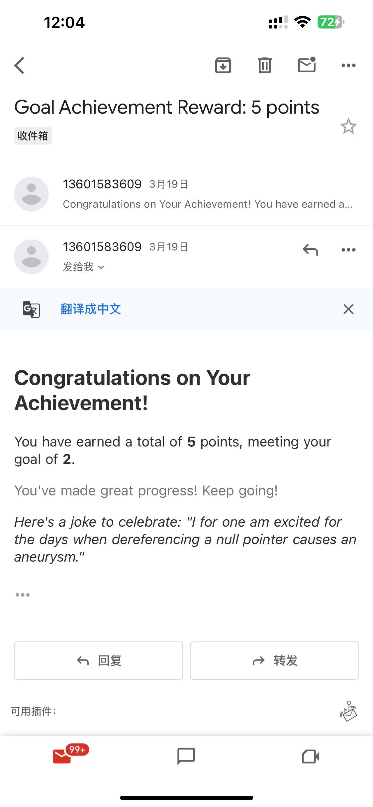

# ZephyrTask
[](https://github.com/software-students-spring2025/3-python-package-super-package/actions/workflows/python-package.yml)


A simple, lightweight Python package for managing tasks with support for prioritization, reminders, and rewards. ZephyrTask provides a clean API for organizing your tasks, reminding you of upcoming deadlines, and rewarding your accomplishments.

## Features

- **Task Management**: Add, update, and remove tasks with customizable time and value parameters
- **Task Listing**: List tasks with various sorting options (upcoming, by priority, etc.)
- **Task Completion**: Mark tasks as completed and track your progress
- **Reminder System**: Get email reminders for upcoming tasks to stay on track
- **Reward System**: Receive motivational rewards when completing tasks of sufficient value

## Installation

### From PyPI (Recommended)

```bash
pip install ZephyrTask
```

### From Source

```bash
# Clone the repository
git clone https://github.com/software-students-spring2025/3-python-package-super-package.git
cd ZephyrTask

# Install in development mode
pip install -e .
```

## Usage

### Core Task Management

```python
import datetime
from ZephyrTask.tasks import add_task, update_task, remove_task

# Add a task with a string time (ISO format)
add_task("2023-06-15T09:00:00", "Morning meeting", 5)

# Add a task with a datetime object
tomorrow = datetime.datetime.now() + datetime.timedelta(days=1)
add_task(tomorrow, "Lunch with team", 3)

# Update a task's value
update_task("2023-06-15T09:00:00", "Morning meeting", 10)

# Remove a task
remove_task("2023-06-15T09:00:00", "Morning meeting")

# Mark a task as completed
complete("Morning meeting")
```

### Task Listing

```python
from ZephyrTask.tasks import list_tasks

# List all tasks sorted by time
tasks = list_tasks(sort_by="time")

# List all tasks sorted by value (highest first)
tasks = list_tasks(sort_by="value")
```

### Reminder System 

```python
from ZephyrTask.tasks import reminder
reminder(to_email=target_email, tasks_file=temp_tasks_file, deadline=48)

# Configure email reminders
reminder( tasks_file: Optional[str] = None,
    to_email: str = "",
    deadline: int = 24, # searching for tasks remained to be done within given hours, default set is 24
    from_email: str = "13601583609@163.com", #our default email provided for user
    smtp_server: str = "smtp.163.com",
    smtp_port: int = 465,
    login: str = "13601583609@163.com",
    password: str = "password for default email given",
    additional_text: str = "",
    rank: str = "time" ) #2 options for ranking, time & value

```

## Example of reminder mail


### Reward System 

```python
from ZephyrTask.tasks import reward

# Configure motivational rewards
reward_result = reward(
    threshold_value=reward_threshold,
    tasks_file=temp_tasks_file,
    to_email=target_email,
    reward_message="You've made great progress! Keep going!",
    include_joke=True)
```

## Example of reward mail



## For Contributors

### Development Setup

```bash
# Clone the repository
git clone https://github.com/software-students-spring2025/3-python-package-super-package.git
cd ZephyrTask

# Create and activate a virtual environment
pipenv --python 3.9
pipenv shell

# Install package in development mode
pipenv install -e .

# Install development dependencies
pipenv install pytest build twine

# Run tests
pytest
```

### Development Workflow

1. Create a feature branch for your work

2. Implement your changes and add tests

3. Make sure tests pass
   ```bash
   python -m pytest
   ```

4. Create a pull request to the main branch

## Project Structure

```
3-python-package-super-package/     # Root project directory
├── ZephyrTask/                     # Main package source code
│   ├── __init__.py                 # Package initialization and exports
│   ├── tasks.py                    # Core task management; Task listing and completion tracking; Email reminder system; Motivational reward system
│
├── tests/                          # Test directory
│   ├── __init__.py                 # Test package initialization
│   ├── test_tasks.py               # Tests for tasks module
│
├── examples/                       # Example scripts
│   ├── example_usage.py            # Basic package usage examples
│
│-- docs/                           # Documentation files
│   ├── mail.jpg                    # Example of reminder mail
│   └── reward.jpg                  # Example of reward mail
│
├── .github/                        # GitHub specific files
│   └── workflows/                  # GitHub Actions workflows
│       ├── python-package.yml      # CI workflow for testing and building
│       └── event-logger.yml        # CI workflow for logging events
├── pyproject.toml                  # Project configuration (PEP 517/518)
├── Pipfile                         # Pipenv dependency management
├── Pipfile.lock                    # Locked dependencies (ensure reproducibility)
├── README.md                       # Project documentation
├── LICENSE                         # License information
└── .gitignore                      # Git ignore patterns
```

### Key Modules

- **tasks.py**: 
- Core module for adding, updating, and removing tasks. Tasks are stored as JSON with timestamps, descriptions, values, and completion status.

- Module for listing tasks with various sorting and filtering options, and for marking tasks as completed.
  
- Module for setting up and sending email reminders for upcoming tasks.
  
- Module for providing motivational rewards when users complete tasks of sufficient value.

## Data Storage

By default, tasks are stored in a JSON file at `~/.ZephyrTask_data.json`. Each task has the following structure:

```json
{
  "time": "2023-06-15T09:00:00",
  "event": "Morning meeting",
  "value": 5,
  "completed": false
}
```

You can specify a custom file path when using the API functions.

## Contributors

- [Xingjian](https://github.com/ScottZXJ123) - Core Task Management
- [Lan](https://github.com/ziiiimu) - Task Listing and Completion
- [Yuquan](https://github.com/N-A-E-S) - Email Reminders
- [Yilei](https://github.com/ShadderD) - Reward System

## License

This project is licensed under the MIT License - see the LICENSE file for details.
